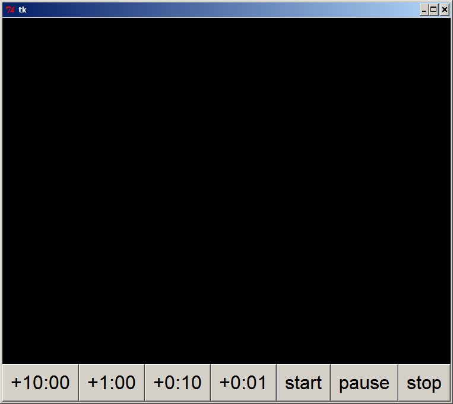

==========
CountdownJ
==========

----------------------------------------------------------------------
display a clock of time remaining for speakers in a conference session
----------------------------------------------------------------------

:author: Pete R. Jemian
:git: https://github.com/prjemian/CountdownJ
:describes: describes 2006-09-04 of **speakerTimer.py**.

.. sidebar::  developmental version

   ..  caution:: not ready for production
   
	   This documentation describes 
	   **speakerTimer.py**, a Python predecessor of the current project.
	   
	   It is provided as interim until proper documentation is created 
	   for the current Java version.

Motivation
===========

Have you ever been a speaker at a meeting and talked too long? If you'd known 
you only had 3 minutes left, you might have restructured your next remarks.

Perhaps you have been a session organizer and all your speakers take a few extra 
minutes. Your session schedule is just shot to bits.

Here is a tool that will help to keep speakers on schedule by providing a display 
of the time remaining for them to speak. Giving feedback to speaker, sessions 
moderator, and even session attendees, this simple tool has been useful in helping 
conference sessions stick close to the schedule through social engineering. Here 
is a terse list of the initial display requirements::

    > 05:00      green    PRESENTATION
    > 00:00      yellow   DISCUSSION
    < 00:00      red      OVERTIME
      05:00     1 beep
      00:00     2 beeps
     -01:00     3 beeps  (at each minute)

 To-Do List
 ==========
 
.. note:: This list, as described 2006-08-17 for the Python version predecessor.
   some may have been addressed in the Java version already.

* There is no provision to provide a GUI for configuring the tool or 
  saving/restoring a non-default configuration. That will come. The code already 
  has the labels stored as data. All that is needed is to create the GUI 
  mechanisms to edit/save/recover these.
  
  note: addressed in this java version

* The beep capability needs to be much more robust. There does not seem to be a 
  native-Python and system-independent method to access the OS-specific default 
  system beep. This needs work. The present method works best (on Windows XP) with 
  Enthought Python or ActiveState Python.

* It has been reported that on Mac OS X, the beep would not work when starting 
   speakerTimer from an xterm. However, it worked when started from Terminal.all.

* It would be good to provide a checkbox to (de)activate the beep

* Change the start, pause, and stop button text to the symbols standard on most 
  DVD tools. You know the ones already. 

Instructions
============

The user interface is simple. 

* Maximize the window on the screen.
* Add time to the clock for the presentation.
* If too much time is added, press stop to clear and re-enter the time needed.
* Start the timer when the speaker starts.
* Pause if necessary. Press start to resume.
* Stop the timer when the presentation is done.
* Clock will clear on stop or when pause is in overtime.

Screen Examples
===============

Initial Screen
--------------

	Initial screen is blank (since the timer is not programmed yet). 
	Note the configuration buttons at the bottom. 
	+10:00 will add 10 minutes to the countdown timer clock. 
	The other buttons are similar. *start*, *pause*, and *stop* are intuitive. 
	*stop* is also be used to clear the countdown timer 
	before counting is started. 

Before talk starts
------------------

..	figure:: armed.png
	:alt: armed
	:width: 30%
	:align: center

	Next speaker has 25 minutes for a presentation. 
	Have the session moderator or monitor press the 
	start button when the speaker starts. 

Talk has started
----------------

..	figure:: presentation.png
	:alt: presentation
	:width: 30%
	:align: center

	The talk has begun. Countdown timer is churning away. 
	Timer will beep once when time reaches 5 minutes. 

Talk has paused
---------------

..	figure:: paused.png
	:alt: paused
	:width: 30%
	:align: center

	The talk has been paused. 
	Maybe some interruption? 

Discussion time
---------------

	The talk has only a short time left. 
	Time to consider audience questions. 
	Timer will beep twice when clock reaches zero. 

Time is over
------------

..	figure:: overtime.png
	:alt: overtime
	:width: 30%
	:align: center

	Time has run out. Speaker should wrap things up. 
	Timer will beep 3 times every minute into overtime.
