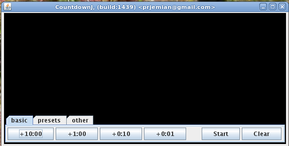
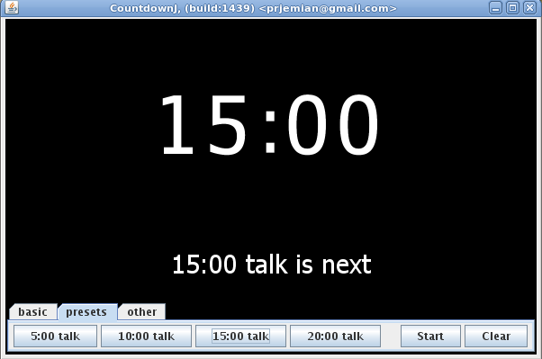
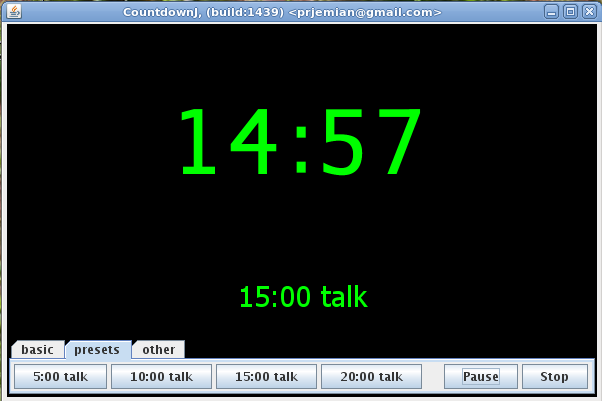
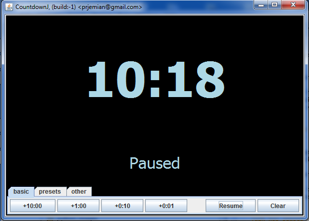
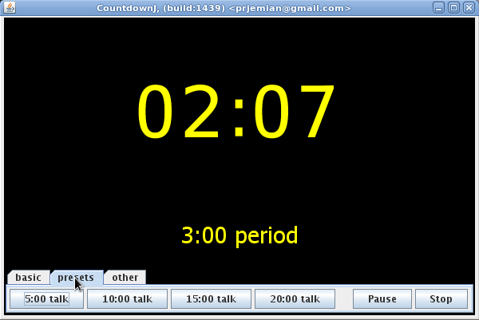
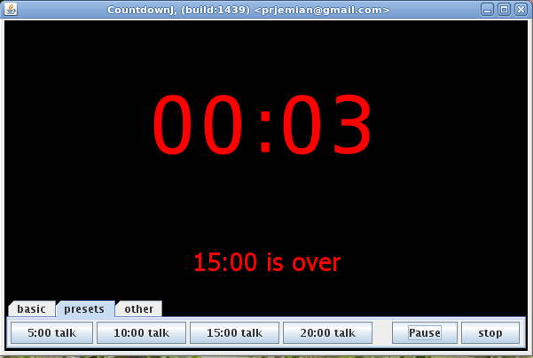

============
Instructions
============

.. sidebar:: under construction

   re-write to include the config and other screens

The user interface is simple. 

* Maximize the window on the screen.
* Add time to the clock for the presentation.
* If too much time is added, press stop to clear and re-enter the time needed.
* Start the timer when the speaker starts.
* Pause if necessary. Press start to resume.
* Stop the timer when the presentation is done.
* Clock will clear on stop or when pause is in overtime.

Screen Examples
===============

Initial Screen
--------------

   Basic screen provides controls to add time to the current or next presentation.
   
   Other buttons are intuitive: *Start* and *Clear*.  Once the timer has started,
   *Start* changes to *Pause*.  When paused, *Pause* changes to *Resume*.
   
   Tabs access *Presets* (preset talk lengths) and *other* controls (*Configure* and *About*).

Before talk starts
------------------

	Next speaker has 15 minutes for a presentation. 
	Have the session moderator or monitor press the 
	start button when the speaker starts. 

Talk has started
----------------

	The talk has begun. Countdown timer is churning away. 
	Timer will beep once when time reaches 5 minutes. 

Talk has paused
---------------

	The talk has been paused. 
	Maybe some interruption? 

Discussion time
---------------

	The talk has only a short time left. 
	Time to consider audience questions. 
	Timer will beep twice when clock reaches zero. 

Time is over
------------

	Time has run out. Speaker should wrap things up. 
	Timer will beep 3 times every minute into overtime.
